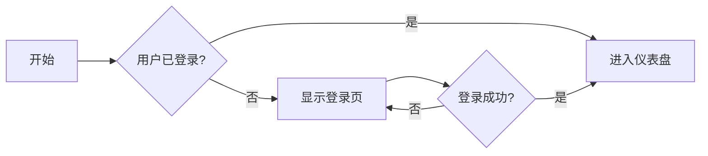

# NoteMark 示例文档

> 这是一份用于演示 **NoteMark** 编辑器能力的示例文档。在编辑器中输入 `/` 即可唤起**命令菜单**，快速插入下方各类内容。

---

**行内样式：**

**加粗**、*斜体*、`行内代码`、<u>下划线</u>、~~删除线~~、$\LaTeX$、H$_2$O、==高亮==、[链接](#)

---

**图片：**


---

**标题：**

# 一级标题

## 二级标题

### 三级标题

#### 四级标题

##### 五级标题

###### 六级标题

---

**引用：**

> 引用块：“这是一段引用。”
>
> > 嵌套引用：“这是引用中的引用。”

---

**代码块：**

```python
# NoteMark 示例代码
def hello():
    print("Hello, NoteMark!")
```

---

**提示块（Alerts）：**

> [!NOTE]
>
> 这是一条普通提示。

> [!TIP]
>
> 这是一个小技巧提示。

> [!IMPORTANT]
>
> 这是一条重要提示。

> [!WARNING]
>
> 这是一条警告提示。

> [!CAUTION]
>
> 这是一条注意（危险）提示。

---

**无序列表：**

- 项目 1
  - 子项目 1.1
  - 子项目 1.2
  - 子项目 1.3
    - 子子项目 1.3.1
    - 子子项目 1.3.2
- 项目 2
- 项目 3

---

**有序列表：**

1. 第一项
   1. 子项 1.a
   2. 子项 1.b
2. 第二项
3. 第三项

---

**任务列表：**

- [ ] 待办任务 1
- [x] 已完成任务
- [ ] 待办任务 2

---

**表格：**

| 列 1 | 列 2  |  列 3 |
| --- | :--- | :--: |
| 行 1 | 数据 1 | 数据 2 |
| 行 2 | 数据 3 | 数据 4 |

---

**公式块：**

$$
\mathcal{F}(f)(\xi) = \int_{-\infty}^{\infty} f(x) e^{-2\pi i x \xi} dx
$$

---

**Mermaid 图表：**



---

**脚注：**

这是脚注引用的示例[^1]。

[^1]: 这是脚注的具体内容。

---

**目录（TOC）：**

[toc]

---

Enjoy using **NoteMark**！
